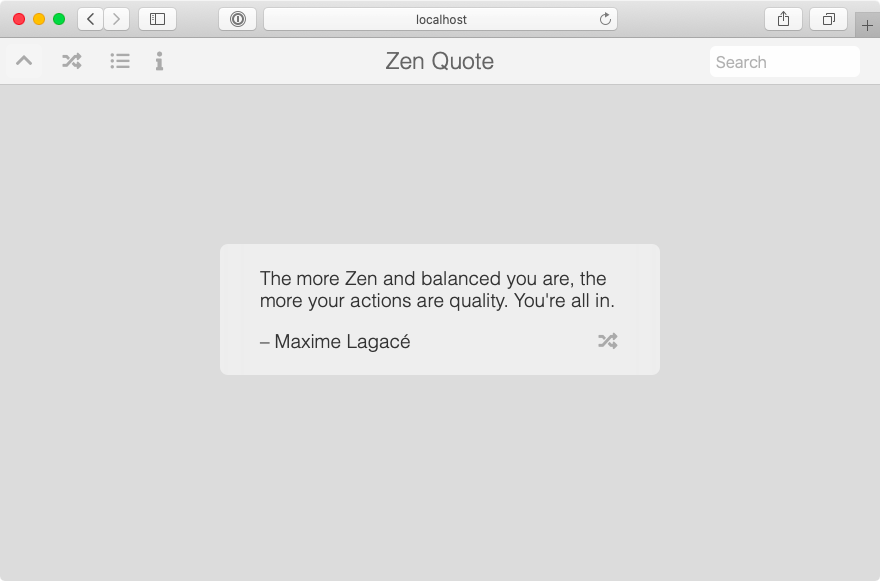
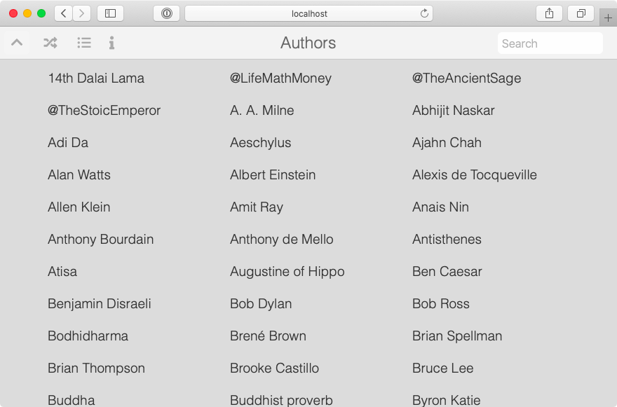

# Zen Quote

Zen Quote is a Node.js RESTful API for accessing Zen Quotes from a SQLite3 database. Also provides a web UI that communicates with the API through javascript. It is based on the [Express](http://expressjs.com/) web framework and [Sequelize](https://sequelize.org/) ORM for accessing the database.

https://github.com/magnus-leksell/zen-quote/

## Get the source

    git clone https://github.com/magnus-leksell/zen-quote.git

## Build

    npm install

## Start the server

    npm run devstart

This starts the server on port 3000. Use a web browser and go to http://localhost:3000/ for the nice user interface; a user friendly interaction with the API using static HTML, vanilla JavaScript and CSS.

## Web user interface

### `/?id={id}`

Shows a specific quote in the UI with the given id, example `/?id=42`.

### `/api-docs`

Detailed documentation about the endpoints below.

## API endpoints

Queries to the database is case insensitive.

### `GET /api/authors`

Returns all authors or authors mathcing optional query, `?q=something`, at least 3 characters needed. Example `/api/authors?q=watts` which return authors containing _watts_.

### `GET /api/quotes/{id}`

Returns a quote. Example `/api/quotes/585`.

### `GET /api/quotes/random`

Returns a random quote.

### `GET /api/quotes`

Returns quotes matching query. Example `/api/quotes?q=zen` which returns quotes which quote text **or** author contains _zen_ (this is the search done from the user interface), `/api/quotes?author=watts` which returns quotes that have author containing _watts_, or `/api/quotes?q=zen&author=watts` which returns quotes that contains _zen_ **and** have author containing _watts_. One of, or both, query parameters `q` or `author`is required, and at least 3 characters each needed to be considered when quering the database.

## The database

It contains one table, quotes;

Column | Type | Description
-------|------|------------
id | Integer | Primary key
author | String | Name of author
quote | Text | Quote text

## Notes

There are 893 quotes from about 214 different authors in the database.

## Author

**Magnus Leksell** - https://github.com/magnus-leksell

## License

This project is licensed under the MIT License - see the [LICENSE](LICENSE) file for details.